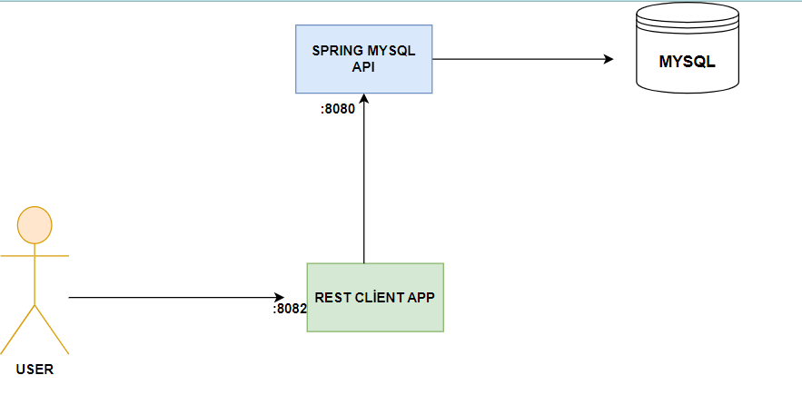

# :triangular_flag_on_post: 
 Rest Template

<b> Spring RestTemplate, Spring Framework tarafından sağlanan bir HTTP istemci kütüphanesidir. RestTemplate, HTTP istekleri göndermek ve yanıtları almak için kullanılabilir.</b>

<b> RestTemplate, RESTful web servislerine istek gönderirken kullanılabilecek birçok özelliğe sahiptir. Örneğin, GET, POST, PUT, DELETE vb. HTTP metotlarını destekler. Ayrıca, HTTP isteklerinde başlık, parametre ve gövde gibi farklı özellikleri yapılandırmak için esnek bir API sunar.</b>

<b> RestTemplate, Spring Framework'teki diğer bileşenlerle kolayca entegre edilebilir ve Spring Boot gibi projelerde önceden yapılandırılmış olarak mevcuttur.</b>

### 🎯 Spring RestTemplate'in birkaç özelliği şunlardır:

1. <b> HTTP isteklerini yönetme: </b> RestTemplate, HTTP isteklerini yönetmek için kullanılan önceden yapılandırılmış metotlar sağlar. Bu metotlar, GET, POST, PUT, DELETE vb. HTTP metotlarını destekler.
2. <b> Özelleştirilebilir istekler:</b> RestTemplate, HTTP isteklerinde parametre, başlık ve gövde gibi farklı özellikleri yapılandırmak için esnek bir API sunar. Bu sayede istekleri özelleştirerek RESTful web servislerine daha uygun hale getirebilirsiniz.
3. <b> Yanıt işleme:</b> RestTemplate, HTTP yanıtlarını almak ve işlemek için önceden yapılandırılmış metotlar sağlar. Bu metotlar, JSON, XML ve diğer veri biçimlerini otomatik olarak işleyebilir.
4. <b> Synchronous veya Asynchronous çağrılar:</b> RestTemplate, HTTP isteklerini senkronize veya asenkronize olarak göndermek için kullanılabilir. Senkronize çağrılar, istek gönderildiğinde yanıtın tamamlanmasını beklerken, asenkronize çağrılar arka planda istekleri gönderir ve yanıtı işler.
5. <b> Güvenlik:</b> RestTemplate, HTTPS üzerinden iletişim kurmanıza olanak tanıyan SSL/TLS desteği sağlar. Ayrıca, kimlik doğrulama, yetkilendirme ve diğer güvenlik konularında Spring Framework'ün sağladığı özellikleri de kullanabilirsiniz.
6. <b> Hata işleme:</b> RestTemplate, HTTP isteklerinde ortaya çıkan hataları işlemek için önceden yapılandırılmış metotlar sağlar. Bu metotlar, HTTP hata kodlarını otomatik olarak işleyebilir veya özel hata işleme kodu ekleyebilirsiniz.

### :pushpin: Bu projede ise Java-Spring-Crud-Example projesine istek gönderiyoruz.  
<b> <i>
localhost :8082 de ayağa kaldırdığımız bu spring boot projesi localhost :8080’e bağlanmaktadır.
:8080 portumuz da zaten halihazırda isteklerimiz vardı bunların getAll() ve createUser() metodlarını kullanmış olduk. </i></b>

